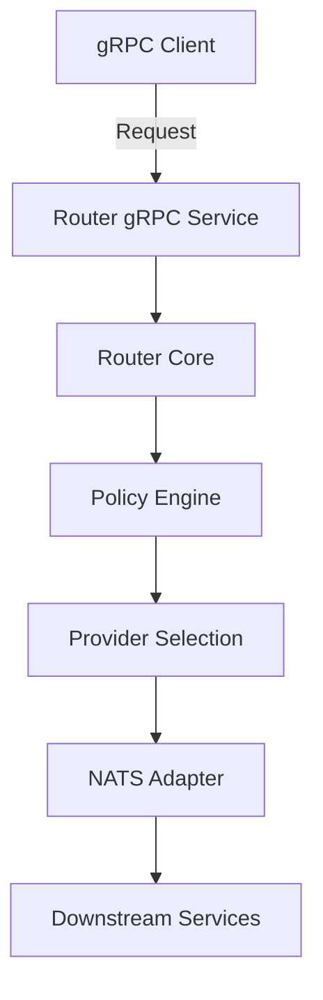

# Beamline Router

[](https://ci.beamline.example.com/beamline/router)
[](https://coveralls.io/github/beamline/router?branch=main)
[](https://opensource.org/licenses/Apache-2.0)

Core routing component of the Beamline platform, responsible for efficient message routing with support for complex routing policies, circuit breaking, and observability.

## 📚 Documentation

For comprehensive documentation, please refer to the main project documentation:

- [Routing Policy](https://github.com/beamline/beamline/blob/main/docs/ROUTING_POLICY.md) - Detailed documentation on routing policies and configuration
- [Architecture](https://github.com/beamline/beamline/blob/main/docs/ARCHITECTURE.md) - System architecture and component interactions
- [API Contracts](https://github.com/beamline/beamline/blob/main/docs/API_CONTRACTS.md) - gRPC API specifications
- [Observability](https://github.com/beamline/beamline/blob/main/docs/OBSERVABILITY.md) - Metrics, logging, and tracing

## 🏗️ Architecture Overview



### Core Components

| Component | Description |
|-----------|-------------|
| `router_core.erl` | Main routing logic and request processing |
| `router_decider.erl` | Provider selection algorithm |
| `router_policy_store.erl` | Policy management and caching |
| `router_grpc.erl` | gRPC server implementation |
| `router_nats_adapter.erl` | NATS messaging integration |

## 🚀 Quick Start

### Prerequisites

- Erlang/OTP 26+
- rebar3
- NATS Server (for production)

### Building

```bash
# Clone the repository
git clone https://github.com/beamline/beamline.git
cd beamline/apps/otp/router

# Install dependencies
rebar3 deps get

# Compile
rebar3 compile
```

### Running Tests

```bash
# Run standard test suite (default)
rebar3 ct

# Run with coverage
rebar3 cover

# Run specific test suite
rebar3 ct --suite test/router_core_SUITE

# Run heavy/extended tests (e.g. JetStream recovery scenarios)
# These tests simulate prolonged failures, soak testing, and complex recovery scenarios.
# They are skipped by default to keep CI fast.
ROUTER_TEST_LEVEL=heavy rebar3 ct --suite apps/beamline_router/test/router_jetstream_recovery_ext_SUITE
```

### 🧹 Mock discipline lint

- `scripts/lint/check_router_mock_discipline.sh` — ensures `meck:new(..., [passthrough])` usages only coincide with direct `gen_server:call(router_nats, ...)` inside the approved helpers (`router_nats_test_helper`, `router_mock_helpers`). The check ignores `_data/` and `fixtures/` directories, `*.skip*` artifacts, and comment-only lines to avoid false positives.
- `scripts/lint/verify_router_mock_discipline.sh` — temporarily emits `test/router_mock_discipline_violation_SUITE.erl`, runs the lint to assert it fails, then cleans up so the failure can be reproduced without lingering files.
- `./scripts/ct-full.sh` — run the full tier after the mock-discipline lint passes to confirm the quality gate is clean.

## Everyday tasks

```bash
cd /apps/otp/router && ROUTER_TEST_LEVEL=heavy bash scripts/ct-heavy.sh
cd /apps/otp/router && bash scripts/lint/check_quarantine_guardrails.sh
```

## 📦 Dependencies

- [grpcbox](https://github.com/tsloughter/grpcbox) - gRPC server implementation
- [jsx](https://github.com/talentdeficit/jsx) - JSON processing
- [nats_msg](https://github.com/nats-io/nats.erl) - NATS client

## 🔍 Additional Resources

### Operational Documentation

For detailed operational guidance, including deployment, monitoring, and troubleshooting, please refer to the main project's [Operational Guide](https://github.com/beamline/beamline/blob/main/docs/OPERATIONS_GUIDE_RU.md).

### API Documentation

- [gRPC API Reference](https://github.com/beamline/beamline/blob/main/docs/API_CONTRACTS.md)
- [Error Codes](https://github.com/beamline/beamline/blob/main/docs/GRPC_ERROR_CODES.md)
- [API Contracts](https://github.com/beamline/beamline/blob/main/docs/API_CONTRACTS.md)

### Performance and Observability

- [Performance Tuning](https://github.com/beamline/beamline/blob/main/docs/PERFORMANCE.md)
- [Observability Guide](https://github.com/beamline/beamline/blob/main/docs/OBSERVABILITY.md)
- [Metrics and Monitoring](https://github.com/beamline/beamline/blob/main/docs/OBSERVABILITY_METRICS_MONITORING_GUIDE.md)

## 🤝 Contributing

Please see the main project's [Contributing Guide](https://github.com/beamline/beamline/CONTRIBUTING.md) for details on how to contribute to this project.

## 📄 License

This project is licensed under the Apache 2.0 License - see the [LICENSE](LICENSE) file for details.
